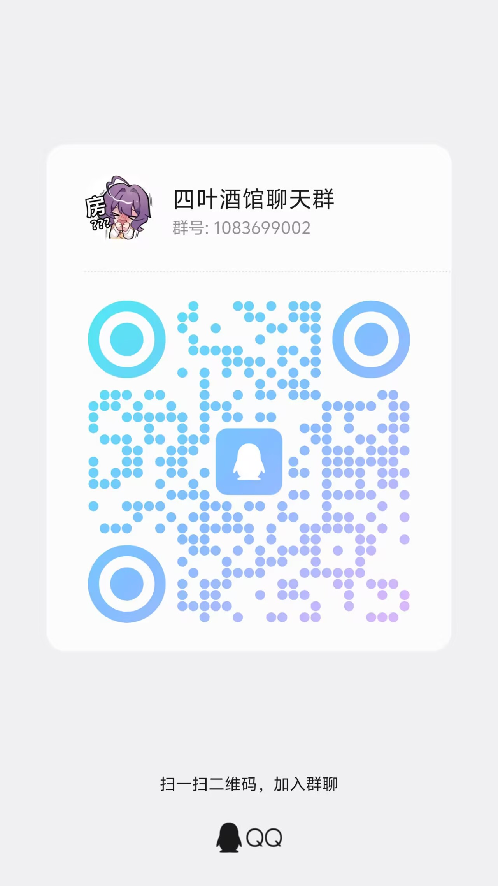
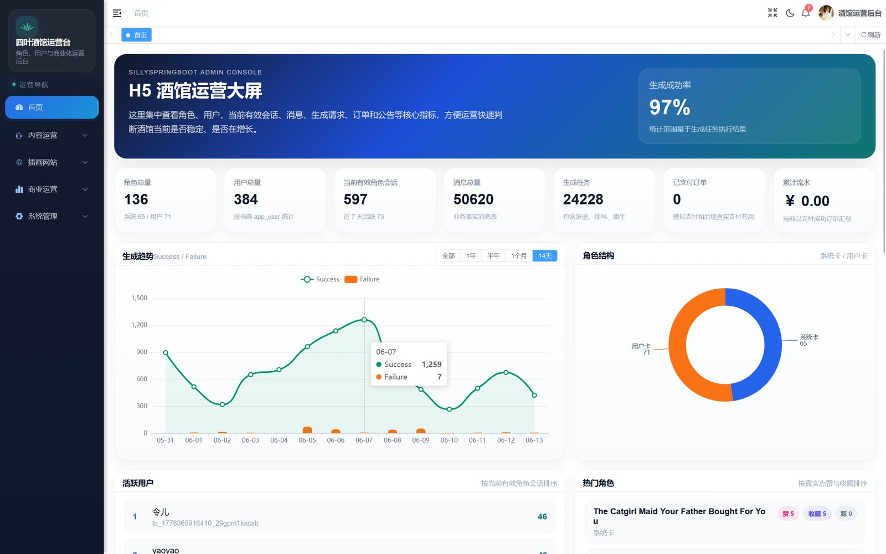
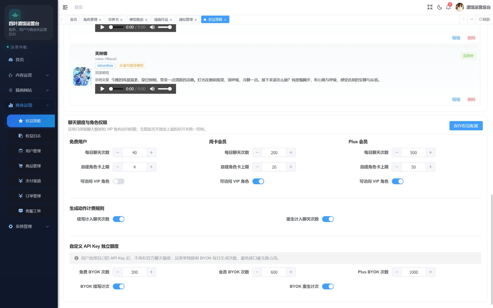
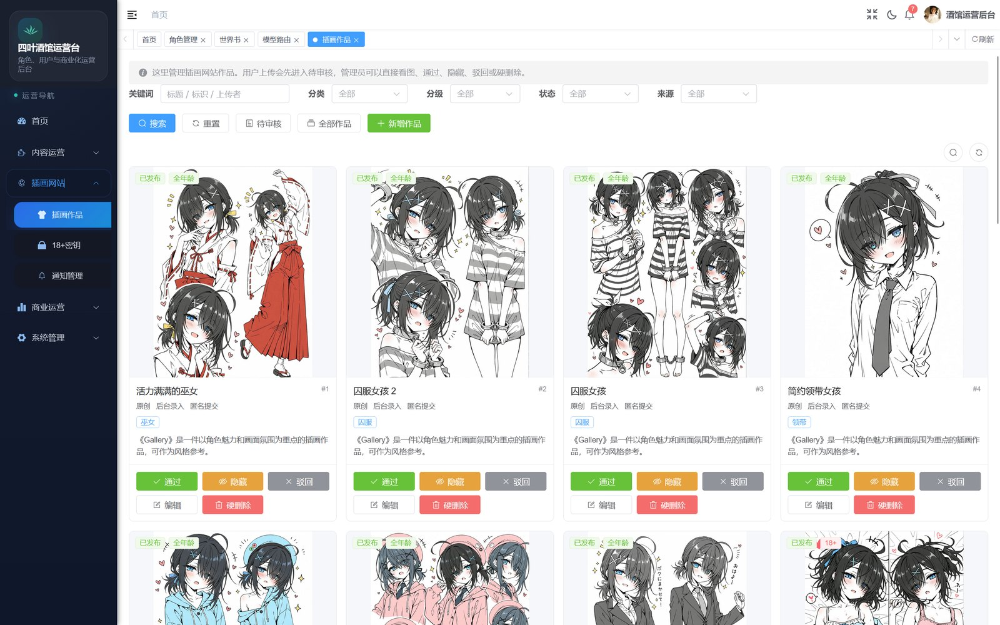
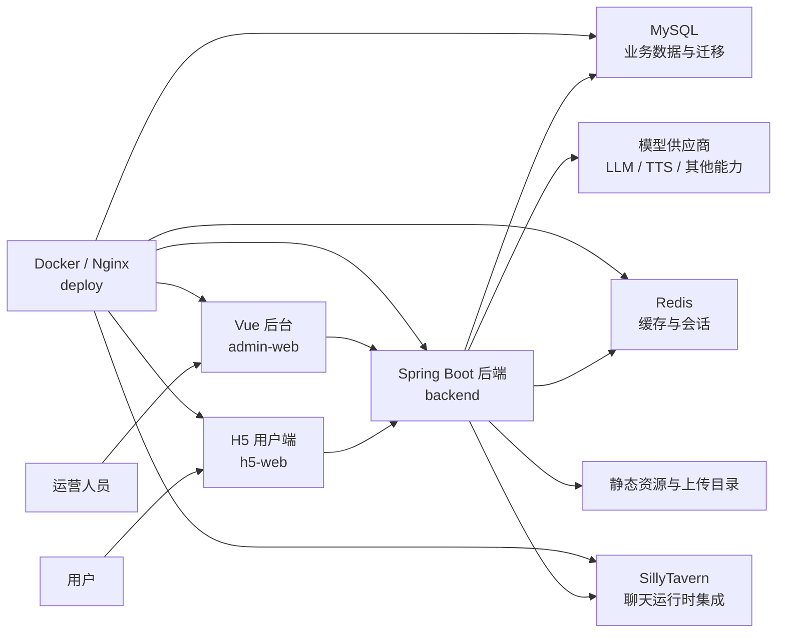
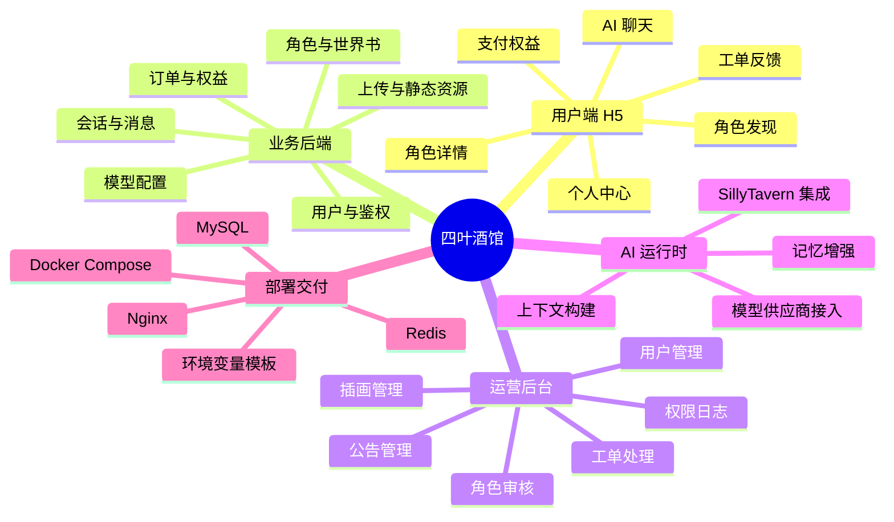

# 四叶酒馆 / Siye AI / JiuGuanSJ

面向 AI 角色互动场景的全栈应用系统。

四叶酒馆不是一个只会调用模型接口的聊天 demo，而是一套把用户端 H5、Spring Boot 业务后端、Vue 运营后台、SillyTavern 聊天运行时集成、角色资产管理、世界书与记忆能力、支付权益、工单反馈、社区互动、插画扩展和 Docker 部署串起来的完整项目。

## 线上体验

用户端体验地址：

<p>
  <a href="https://siyeai.pengqiyao.cn/"><strong>https://siyeai.pengqiyao.cn/</strong></a>
</p>

如果这个项目对你有帮助，欢迎 Star、提 Issue、参与讨论，也欢迎加入官方群交流。

<p>
  
</p>

## 项目预览

### 用户端 H5

<table>
  <tr>
    <td width="50%">
      
      <br>
      <sub>发现页：角色入口、推荐内容与移动端使用路径。</sub>
    </td>
    <td width="50%">
      
      <br>
      <sub>聊天页：角色对话、续写、重生成与沉浸式交互。</sub>
    </td>
  </tr>
  <tr>
    <td width="50%">
      
      <br>
      <sub>角色库：角色内容展示、筛选和进入详情。</sub>
    </td>
    <td width="50%">
      
      <br>
      <sub>后台概览：运营指标、角色会话、消息与订单数据。</sub>
    </td>
  </tr>
</table>

### 运营后台

<p>
  
</p>

<table>
  <tr>
    <td width="50%">
      
      <br>
      <sub>权益策略：免费用户、周卡会员、Plus 会员的额度与访问权限配置。</sub>
    </td>
    <td width="50%">
      
      <br>
      <sub>插画作品：作品筛选、审核、隐藏、驳回和编辑管理。</sub>
    </td>
  </tr>
</table>

## 一句话定位

四叶酒馆是一个把 AI 角色聊天、角色内容管理、用户体验、后台运营和部署交付串起来的完整工程样例。

更具体一点，它解决的不是“怎么让模型回复一句话”，而是：

- 普通用户如何在手机端发现角色、查看详情、进入聊天、继续对话、反馈问题。
- 角色、世界书、头像、封面、审核状态、标签和扩展字段如何成为可管理的业务资产。
- 聊天上下文、历史消息、记忆刷新、续写、重生成和分支如何进入系统能力。
- 运营人员如何管理用户、角色、公告、权益、订单、模型供应商、工单和插画内容。
- 开发者如何理解 H5、后台、后端、数据库、Redis、Nginx、SillyTavern 和 Docker 之间的关系。

## 为什么值得开源

AI 角色聊天项目很容易停留在演示层：一个输入框，一个模型接口，一个聊天窗口。四叶酒馆的价值在于，它已经把大量真实产品会遇到的问题放进同一套系统里。

| 价值 | 说明 |
| --- | --- |
| 产品化入口 | H5 用户端覆盖发现、角色详情、聊天、设置、个人中心、支付和工单等主要路径。 |
| 角色资产管理 | 角色不只是本地文件，而是可入库、可审核、可上下架、可关联世界书和运营数据的内容资产。 |
| 上下文工程 | 角色卡、世界书、历史消息、记忆刷新、续写、重生成、分支等能力为沉浸式互动打基础。 |
| 运营后台 | 后台管理端让角色、用户、订单、公告、工单、模型配置和插画扩展都有可视化入口。 |
| 多端协同 | H5、后台、后端、MySQL、Redis、Nginx、Docker、SillyTavern 和外部模型服务需要真实协作。 |
| 可交付部署 | 项目保留 Docker Compose、Nginx、环境变量模板和部署说明，方便本地运行和服务器迁移。 |
| 二次开发参考 | 适合学习 AI 角色互动系统的工程组织方式，也适合作为后续产品化、商业化或社区化的起点。 |

## 系统结构



## 目录说明

| 路径 | 作用 |
| --- | --- |
| `backend/` | Spring Boot 后端，包含用户、鉴权、角色、聊天、记忆、订单、权益、工单、公告、上传、后台接口和 SillyTavern 集成。 |
| `admin-web/` | Vue 3 / Vite / Element Plus 后台管理端，基于 RuoYi Vue 风格改造。 |
| `h5-web/` | uni-app H5 用户端，覆盖发现、角色库、聊天、我的、支付、工单、社交等用户流程。 |
| `integrations/st-memory-enhancement/` | SillyTavern 记忆增强相关集成材料，可作为运行时扩展参考。 |
| `deploy/` | Docker Compose、Nginx、环境变量模板和部署说明。 |
| `docs/images/` | 开源文档展示图片、截图和交流群图片。 |
| `项目说明文档/` | 中文项目说明，包含项目概览、快速启动、配置、后端、前端、部署、开发维护和接口地图。 |

## 功能地图



## Docker 快速启动

推荐先使用 Docker Compose 体验完整系统。

```bash
cd deploy
cp .env.example .env
```

编辑 `deploy/.env`，把占位值换成你自己的本地配置，尤其是：

```text
MYSQL_ROOT_PASSWORD
MYSQL_PASSWORD
APP_AUTH_SECRET
APP_RUOYI_ADMIN_PASSWORD
APP_RUOYI_JWT_SECRET
SILLYTAVERN_PUBLIC_BASE_URL
```

示例后台账号为 `admin / admin123`，只用于本地体验。公开部署前请换成自己的管理员账号和 bcrypt 密码。

启动：

```bash
docker compose --env-file .env up -d --build
```

默认本地端口：

| 服务 | 地址 |
| --- | --- |
| 后端 API | `http://127.0.0.1:8080` |
| 运营后台 | `http://127.0.0.1:8081` |
| H5 用户端 | `http://127.0.0.1:8082` |
| SillyTavern | `http://127.0.0.1:8000` |

更多部署细节见 [deploy/README.md](deploy/README.md)。

## 本地开发

后端：

```bash
cd backend
./mvnw spring-boot:run
```

Windows：

```powershell
cd backend
.\mvnw.cmd spring-boot:run
```

后台管理端：

```bash
cd admin-web
npm install
npm run dev
```

H5 用户端：

```bash
cd h5-web
npm install
npm run dev:h5
```

## 配置原则

开源版本使用示例配置和占位符，不应提交生产密钥。

常见配置入口：

- 根目录示例：`.env.example`
- 部署示例：`deploy/.env.example`
- 后台前端示例：`admin-web/.env.development.example`、`admin-web/.env.production.example`、`admin-web/.env.staging.example`

敏感值应通过环境变量或服务器密钥管理系统提供，例如：

- `APP_AUTH_SECRET`
- `APP_RUOYI_ADMIN_PASSWORD`
- `APP_RUOYI_JWT_SECRET`
- `SPRING_DATASOURCE_PASSWORD`
- `SILLYTAVERN_API_KEY`

不要把生产密钥写进前端代码、YAML、Dockerfile、截图、Issue 示例或文档片段里。

## 文档地图

如果你第一次阅读项目，建议按这个顺序：

1. [项目说明文档/01-项目概览.md](项目说明文档/01-项目概览.md)
2. [项目说明文档/02-快速启动.md](项目说明文档/02-快速启动.md)
3. [项目说明文档/03-配置说明.md](项目说明文档/03-配置说明.md)
4. [项目说明文档/04-后端说明.md](项目说明文档/04-后端说明.md)
5. [项目说明文档/05-前端说明.md](项目说明文档/05-前端说明.md)
6. [项目说明文档/06-部署说明.md](项目说明文档/06-部署说明.md)
7. [项目说明文档/07-开发维护.md](项目说明文档/07-开发维护.md)
8. [项目说明文档/08-接口地图.md](项目说明文档/08-接口地图.md)

另外几份根目录文档的作用：

| 文档 | 作用 |
| --- | --- |
| [CONTRIBUTING.md](CONTRIBUTING.md) | 说明如何参与贡献、提交 Issue、提交 PR、运行检查和保持代码边界。 |
| [SECURITY.md](SECURITY.md) | 说明安全问题上报方式、密钥管理原则和生产部署加固建议。 |
| [THIRD_PARTY_NOTICES.md](THIRD_PARTY_NOTICES.md) | 说明第三方依赖、上游项目、素材资产和许可证审查要求。 |
| [LICENSE](LICENSE) | 当前开源许可证。 |

## 开源边界

这个仓库应保持为干净的公开交付版本：

- 不提交生产 `.env`、数据库密码、模型供应商密钥、支付密钥、证书、私钥和真实用户数据。
- 不提交 `node_modules/`、`target/`、`dist/`、`unpackage/`、日志、数据库文件、运行时上传目录和本地压缩包。
- 大体积艺术资源、真实商业素材、未确认授权的图片、音频、Live2D 模型和游戏素材应删除、替换为占位文件，或在许可证允许后再加入。
- 如果你基于此项目上线自己的服务，请重新配置域名、密钥、数据库、CORS、后台账号、支付回调和模型供应商信息。

## 许可证

本项目使用 MIT License 发布，详见 [LICENSE](LICENSE)。
