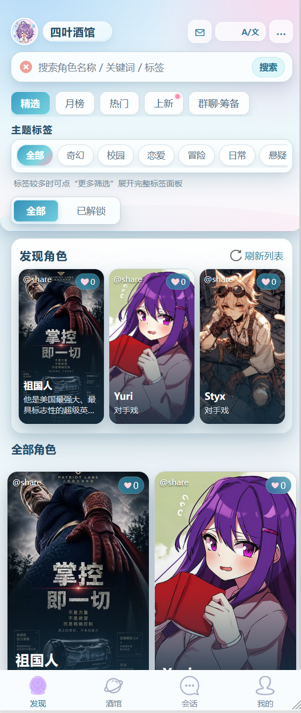
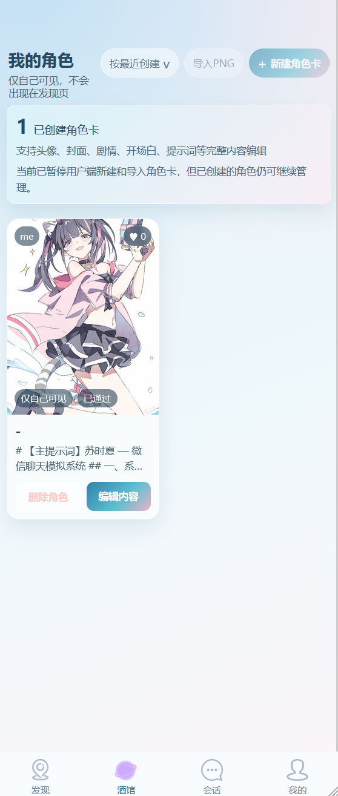
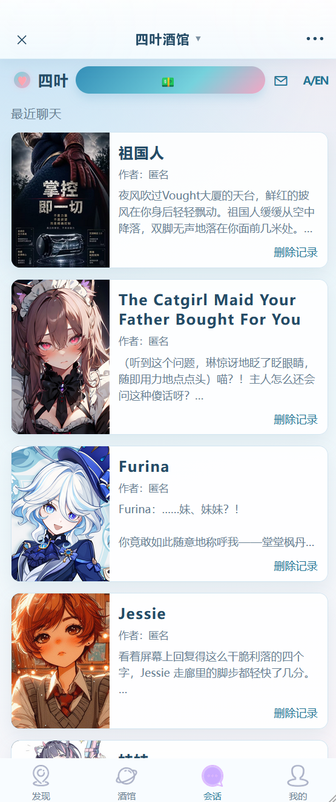
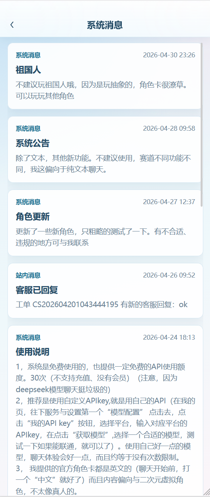
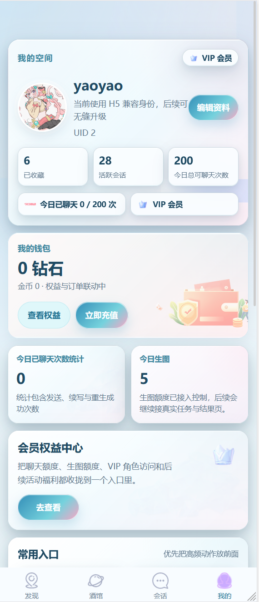
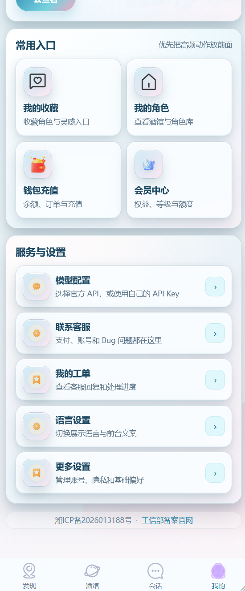
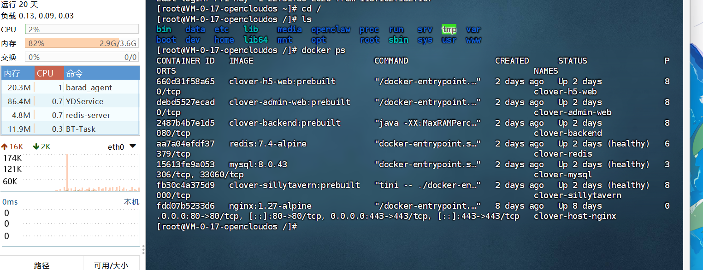
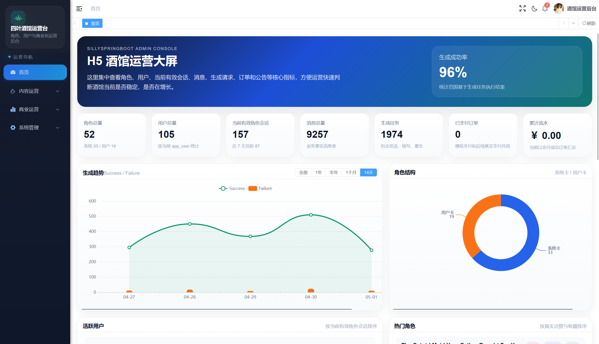
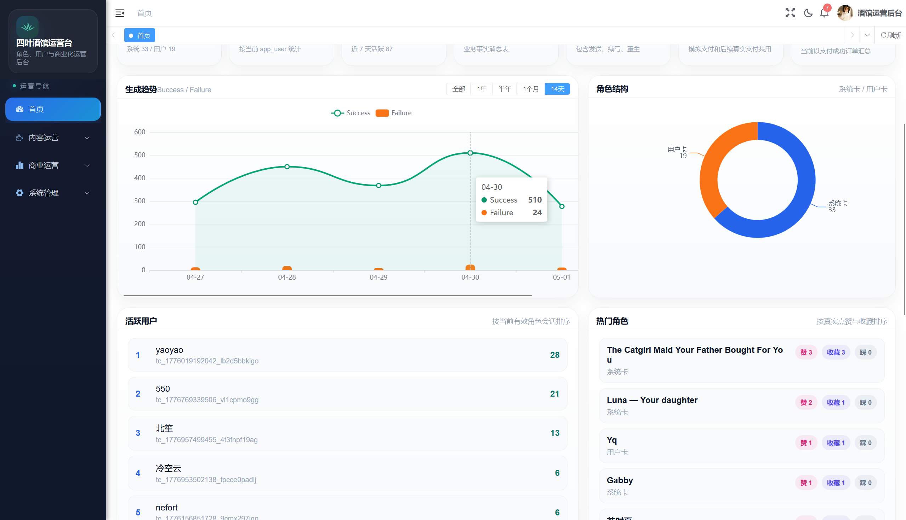

# AI Character Chat H5

一个基于 uni-app 的 AI 角色聊天 H5 前端展示项目。

本项目主要展示 AI 角色聊天产品的移动端用户界面，包括角色广场、角色详情、多轮聊天、用户中心、登录注册、角色创建、客服反馈等页面。适合作为 AI 角色聊天系统的前端参考、项目展示和私有化合作入口。

> 当前仓库为 H5 前端展示版，不包含完整商业后端、管理后台、数据库、模型服务和正式部署脚本。

## Preview

### H5 用户端

| 角色广场 | 角色详情 | 聊天页面 |
| --- | --- | --- |
|  |  |  |

| 用户中心 | 角色创建 | 客服反馈 |
| --- | --- | --- |
|  |  |  |

### 管理后台展示

完整商业系统可配套管理后台，用于角色管理、审核、运营配置、用户管理和系统维护。

| 后台概览 | 角色管理 | 系统配置 |
| --- | --- | --- |
|  |  |  |

更多截图可查看 `screenshots/` 目录。

## 项目定位

AI Character Chat H5 是一个面向移动端的 AI 角色聊天用户端界面项目。

它适合用于：

- AI 角色聊天产品前端展示
- uni-app H5 项目参考
- 移动端暗色主题 UI 参考
- 私有化 AI 聊天系统演示
- 二次开发需求评估
- 商业系统合作引流

本仓库重点展示用户端体验和页面结构，完整商业系统需要配合后端服务、管理后台、数据库、模型接入层和部署环境使用。

## 功能模块

当前 H5 前端包含以下页面与能力：

- 角色广场
- 角色详情
- AI 聊天页面
- 聊天记录入口
- 用户中心
- 登录页面
- 注册页面
- 个人资料编辑
- 角色创建页面
- 角色卡上传入口
- 我的收藏
- 客服反馈
- 工单列表
- 用户协议
- 隐私政策
- 联系方式展示
- 多语言文案基础结构
- 移动端暗色主题样式

## 技术栈

- uni-app
- Vue 2
- JavaScript
- SCSS
- uView UI
- H5

## 完整系统能力

本仓库只包含 H5 用户端展示代码。完整系统可扩展或交付以下能力：

- Spring Boot 后端服务
- Vue3 管理后台
- 用户管理
- 角色管理
- 角色审核
- 多用户会话
- 聊天记录持久化
- 模型接入层
- 流式输出
- 图片上传
- 客服反馈
- 运营配置
- 私有化部署
- Docker 镜像交付
- 源码授权
- 定制开发

## 运行方式

安装依赖：

```bash
npm install
```

然后使用 HBuilderX 或 uni-app 工具运行 H5 项目。

也可以根据自己的前端构建环境执行 H5 构建和预览。

## 目录说明

```text
.
├─ common/          公共 API、工具函数、多语言文案
├─ components/      通用组件
├─ custom-tab-bar/  自定义底部导航
├─ pages/           页面源码
├─ static/          静态资源
├─ store/           状态管理
├─ uni_modules/     uni-app 插件模块
├─ utils/           工具模块
├─ App.vue          应用入口
├─ main.js          启动入口
├─ manifest.json    uni-app 配置
├─ pages.json       页面路由配置
└─ package.json     前端依赖
```

## 商业合作

如果你需要完整 AI 角色聊天系统，可以联系作者沟通以下合作方式：

- H5 前端定制
- 后端接口对接
- 管理后台定制
- 私有化部署
- Docker 镜像交付
- 服务器部署代办
- 源码授权
- 系统二次开发
- UI 改版
- 功能裁剪
- 商业项目落地

## 联系方式

QQ：3956835038

可沟通内容：

- 项目演示
- 私有化部署
- 源码授权
- 二次开发
- H5 前端定制
- 后端接口对接
- 商业合作报价

## 注意事项

本仓库为前端展示项目，不包含完整商业系统源码。

请不要将本项目用于违法、侵权、诈骗、恶意内容生成、违规内容传播等场景。

如果用于商业项目，请根据实际业务补充后端鉴权、内容审核、用户协议、隐私政策、日志安全、接口限流和合规处理。

## License

如需商业使用、完整源码授权或私有化部署，请联系作者确认授权方式。
