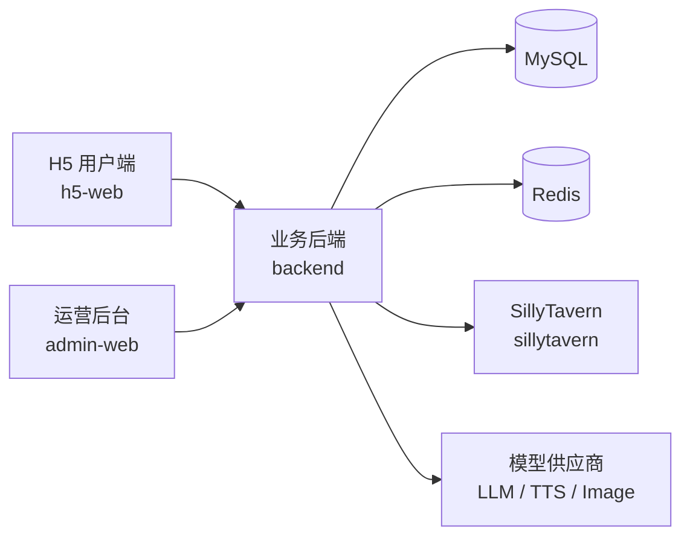
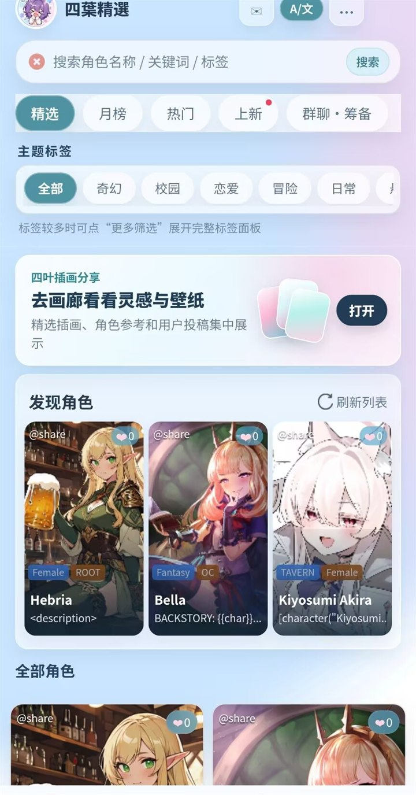
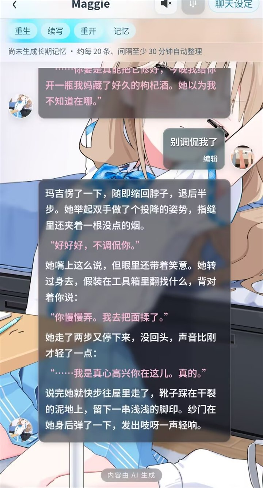
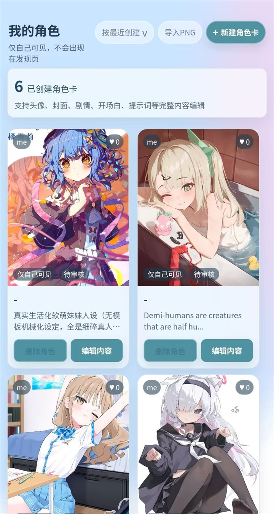
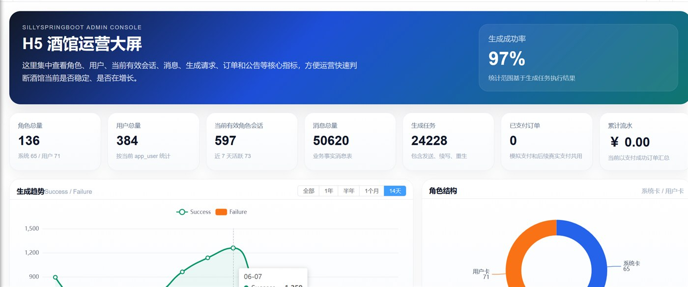
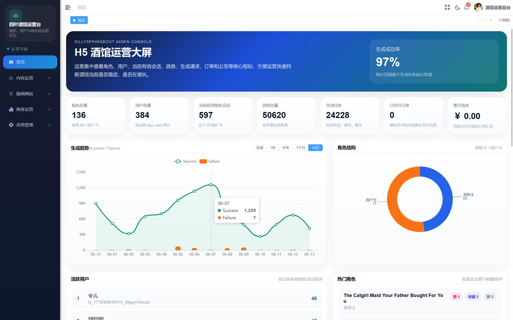
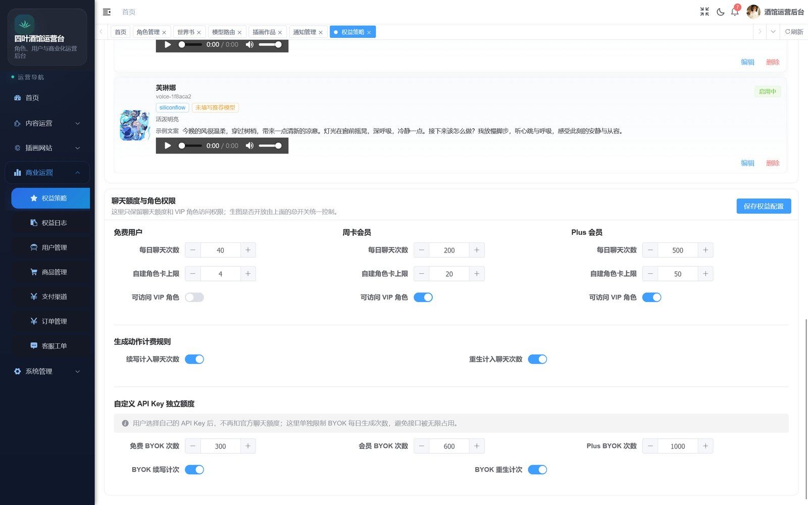
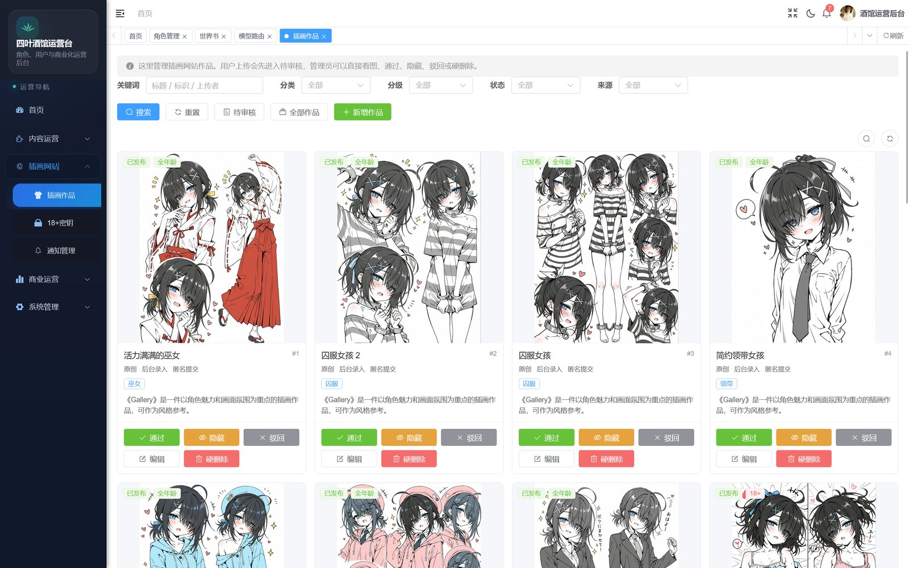
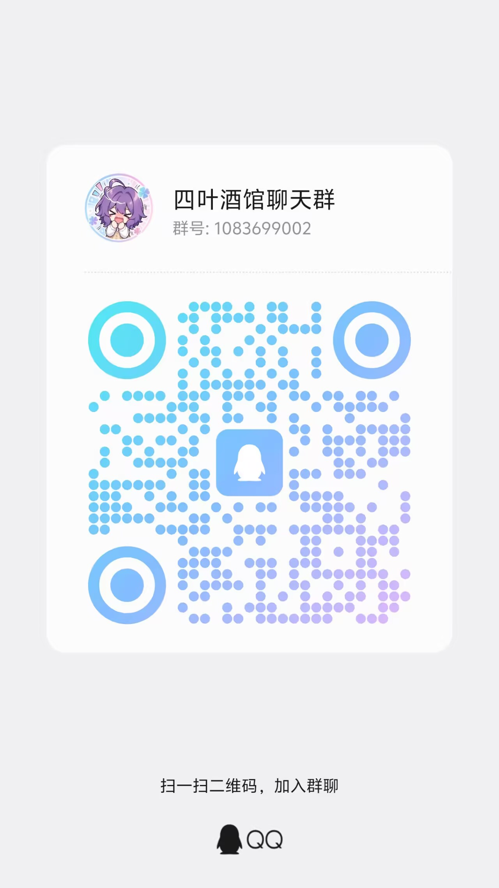

<div align="center">

# 四叶酒馆

**Siye AI**

面向 AI 角色互动场景的全栈应用系统

[](backend/pom.xml)
[](backend/)
[](admin-web/)
[](sillytavern/)
[](LICENSE)

[线上体验](https://siyeai.pengqiyao.cn/) · [项目结构](docs/PROJECT_STRUCTURE.md) · [部署说明](docs/DEPLOYMENT.md) · [问题反馈](https://github.com/pqiyao/siyeAI/issues)

</div>

## 项目简介

四叶酒馆不是单一的聊天界面或模型调用示例，而是一套围绕 AI 角色互动构建的完整应用。项目将移动端用户体验、角色与世界书管理、聊天记忆、运营后台、权益与订单、内容审核，以及 SillyTavern 运行时整合在同一套工程中。

适合用于学习 AI 角色应用的工程组织方式、搭建非商业自托管服务，或作为同类产品的二次开发参考。

## 核心能力

| 领域 | 能力 |
| --- | --- |
| 角色互动 | 角色发现、详情、对话、续写、重生成、会话分支与历史记录。 |
| 上下文工程 | 角色卡、世界书、长期记忆、上下文构建与模型路由。 |
| 多模态能力 | 文本生成、语音、图片生成及相关供应商配置。 |
| 内容运营 | 角色审核、公告、工单、插画内容、标签与资源管理。 |
| 用户与权益 | 用户体系、访问控制、会员权益、额度、订单与支付渠道。 |
| 工程交付 | H5 用户端、运营后台、业务后端、数据库迁移与部署配置。 |

## 系统架构


```mermaid
flowchart LR
  H5["H5 用户端<br/>h5-web"] --> API["业务后端<br/>backend"]
  Admin["运营后台<br/>admin-web"] --> API
  API --> MySQL[(MySQL)]
  API --> Redis[(Redis)]
  API --> ST["SillyTavern<br/>sillytavern"]
  API --> Providers["模型供应商<br/>LLM / TTS / Image"]
```

| 目录 | 说明 |
| --- | --- |
| [`backend/`](backend/) | Java 17 / Spring Boot 业务后端与数据库迁移。 |
| [`admin-web/`](admin-web/) | Vue 3 / Vite / Element Plus 运营后台。 |
| [`h5-web/`](h5-web/) | uni-app H5 用户端。 |
| [`sillytavern/`](sillytavern/) | SillyTavern 聊天运行时与集成代码。 |
| [`docs/`](docs/) | 项目结构、部署说明与展示资源。 |

更完整的模块边界和开发入口见 [项目结构文档](docs/PROJECT_STRUCTURE.md)。

## 项目预览

### 用户端

<table>
  <tr>
    <td width="50%" align="center">
      
      <br><sub>角色发现</sub>
    </td>
    <td width="50%" align="center">
      
      <br><sub>角色聊天</sub>
    </td>
  </tr>
  <tr>
    <td width="50%" align="center">
      
      <br><sub>角色库</sub>
    </td>
    <td width="50%" align="center">
      
      <br><sub>数据概览</sub>
    </td>
  </tr>
</table>

### 运营后台

<p align="center">
  
</p>

<table>
  <tr>
    <td width="50%" align="center">
      
      <br><sub>权益策略</sub>
    </td>
    <td width="50%" align="center">
      
      <br><sub>内容审核</sub>
    </td>
  </tr>
</table>

## 快速开始

完整运行需要 Java 17、Node.js 20+、MySQL 8+ 和 Redis 6+。首次部署前请先阅读 [部署说明](docs/DEPLOYMENT.md)。

### 启动后端

```bash
cd backend
./mvnw spring-boot:run
```

Windows 使用：

```powershell
cd backend
.\mvnw.cmd spring-boot:run
```

### 启动运营后台

```bash
cd admin-web
npm install
npm run dev
```

### 启动 SillyTavern

```bash
cd sillytavern
npm install
npm start
```

H5 用户端位于 `h5-web/`，建议使用 HBuilderX 打开并运行到 H5。

## 配置与安全

生产环境必须通过环境变量或密钥管理系统提供敏感配置。至少应替换以下项目：

```text
APP_AUTH_SECRET
APP_RUOYI_ADMIN_PASSWORD
APP_RUOYI_JWT_SECRET
SPRING_DATASOURCE_PASSWORD
SILLYTAVERN_API_KEY
```

请勿提交生产 `.env`、数据库文件、真实用户数据、模型或支付密钥、证书及私钥。示例账号和默认配置仅用于本地开发，不得直接用于公网部署。

## 文档

- [项目结构](docs/PROJECT_STRUCTURE.md)：模块职责、调用关系与开发入口。
- [部署说明](docs/DEPLOYMENT.md)：环境要求、构建流程、反向代理和上线检查。
- [许可证](LICENSE)：使用、修改和再分发条件。

## 社区

欢迎通过 [Issues](https://github.com/pqiyao/siyeAI/issues) 提交问题和建议。

<details>
  <summary>加入官方群</summary>
  <br>
  
</details>

## 许可证

本项目采用自定义的非商业使用许可。允许个人、教育、研究及其他非商业用途；未经版权所有者事先书面许可，不得用于付费托管、商业产品、收费服务或其他商业用途。完整条款见 [LICENSE](LICENSE)。
