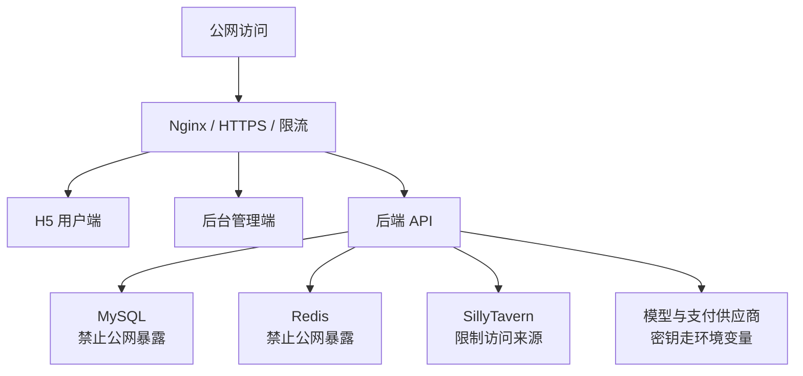

# 安全策略

这份文档说明四叶酒馆 / Siye AI / JiuGuanSJ 的安全问题上报方式、密钥管理原则、开源发布边界和生产部署加固建议。

项目涉及 AI 聊天、用户账号、后台管理、支付权益、上传资源、模型供应商密钥和部署配置，因此安全边界必须清楚。

## 安全问题上报

如果你发现安全漏洞，请不要在公开 Issue 中直接发布可利用细节。

建议通过仓库主页、项目文档或维护者公开联系方式进行私下反馈，并尽量包含：

- 受影响模块：`backend`、`admin-web`、`h5-web`、`deploy` 或 `integrations`。
- 受影响接口、页面、配置项或容器服务。
- 复现步骤和必要截图。
- 可能影响的数据：账号、Token、聊天记录、订单、支付回调、上传文件、模型密钥等。
- 你判断的风险等级和修复建议。

维护者确认后，可在修复发布完成再公开说明。

## 绝对不要提交的内容

开源仓库中不应出现：

- 生产 `.env` 文件。
- 数据库密码、Redis 密码、后台管理员密码。
- `APP_AUTH_SECRET`、`APP_RUOYI_JWT_SECRET` 等签名密钥。
- 模型供应商 API Key、TTS Key、SillyTavern API Key。
- 支付私钥、回调密钥、商户证书。
- Telegram Bot Token、Webhook Secret 或其他机器人密钥。
- SSH 私钥、云厂商 Access Key、证书、Keystore。
- 数据库 dump、真实用户数据、聊天记录、订单记录、支付记录。
- 运行时上传目录、日志、构建产物、服务器压缩包。

示例配置只能写占位符，例如：

```text
APP_AUTH_SECRET=change-me
SPRING_DATASOURCE_PASSWORD=change-me
SILLYTAVERN_API_KEY=optional-change-me
```

## 生产部署加固



上线时建议：

- 使用 HTTPS，并让所有公网入口经过 Nginx 或网关。
- MySQL、Redis 不暴露到公网，只允许后端容器或内网访问。
- 后台管理端限制访问来源，至少使用强密码，必要时增加 IP 白名单或额外认证。
- `APP_AUTH_SECRET`、`APP_RUOYI_JWT_SECRET` 使用足够长的随机值。
- 后台管理员密码不要使用示例值，生产环境应使用强密码或哈希后的安全配置。
- CORS 和 WebSocket Origin 只允许可信域名。
- 上传目录限制文件类型、大小和访问路径，避免脚本执行和任意文件读取。
- 支付回调必须校验签名，并记录关键日志。
- 模型供应商 Key 只放在服务端环境变量或密钥管理系统中，不进入前端。
- 定期备份 MySQL、上传目录和关键配置。

## 开源发布前检查

每次把私有开发版本同步到开源版本前，建议执行：

1. 检查 `.gitignore` 是否覆盖 `.env`、构建产物、依赖目录、日志、上传目录和数据库文件。
2. 搜索敏感词：`password`、`secret`、`token`、`apikey`、`api_key`、`private_key`、`merchant`、`callback`。
3. 检查 `deploy/` 中是否只有 `.env.example`，没有真实 `.env`。
4. 检查前端代码中是否硬编码生产域名、密钥或私有接口。
5. 检查后台默认账号密码是否只用于本地示例，并在文档中提示修改。
6. 检查截图、日志和文档片段是否泄露服务器地址、真实用户、订单号或 Token。
7. 检查素材是否原创、已授权、占位或已删除。
8. 使用 Docker Compose 至少跑一次本地启动检查。

## 高风险改动提示

以下改动提交 PR 时需要特别说明风险：

- 登录、注册、Token、权限、后台菜单、管理员账号。
- 支付创建、支付回调、订单状态、权益发放。
- 文件上传、静态资源访问、图片代理、导入导出。
- WebSocket、SSE、聊天流式响应。
- 模型供应商配置、API Key 保存、SillyTavern 连接。
- 数据库迁移、用户表、订单表、消息表、权限表。
- Docker、Nginx、CORS、HTTPS、端口暴露。

## 发现密钥泄露后怎么办

如果密钥已经提交到公开仓库：

1. 立刻在对应平台轮换密钥，不要只删除 Git 里的文件。
2. 检查访问日志，确认是否有异常调用。
3. 删除仓库中的明文密钥，并更新 `.gitignore` 与示例配置。
4. 评估是否需要清理 Git 历史。
5. 在发布说明中提醒使用者升级或替换配置。

## 支持范围

当前开源版本主要支持社区审查、学习、二次开发和本地部署验证。生产安全需要结合你的服务器、域名、支付渠道、模型供应商、访问规模和合规要求进行额外加固。
