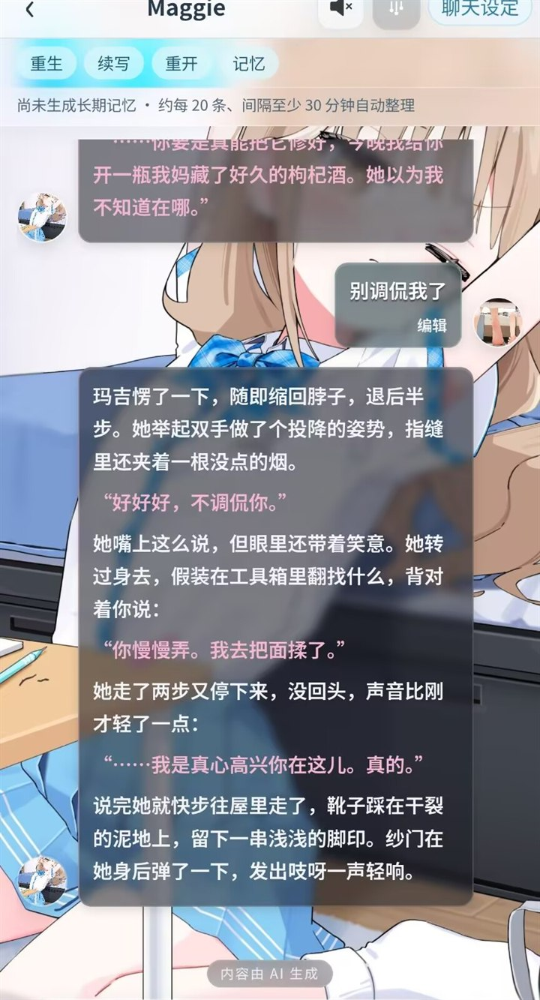
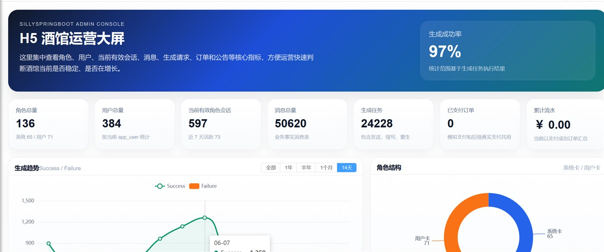
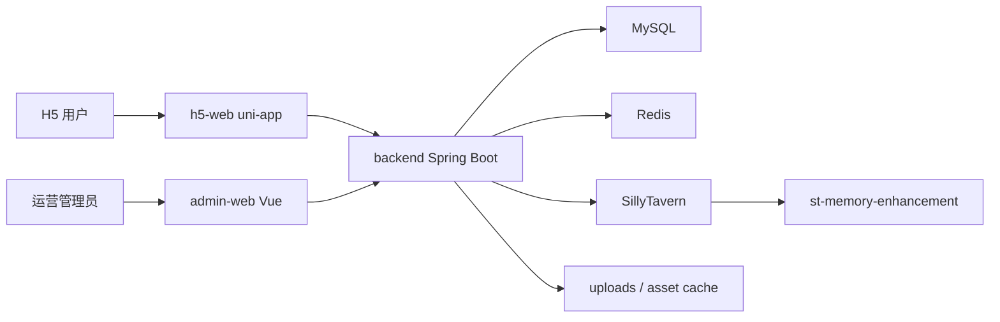

# 项目概览

JiuGuanSJ / Siye AI Complete System 是一套面向 AI 角色聊天、角色卡运营、社区互动和后台管理的完整应用系统。当前开源包已经整理为公开交付结构，包含后端服务、运营管理端、H5 客户端、SillyTavern 记忆增强集成以及 Docker 部署模板。

## 本地体验

本仓库是项目完整开源版本，推荐通过 Docker Compose 在本地启动完整系统后体验。欢迎按文档本地部署或二次开发；如果项目对你有帮助，也欢迎点一个免费的 Star。

## 项目预览

| H5 发现页 | AI 聊天 |
| --- | --- |
|  |  |

| 我的角色 | 运营后台 |
| --- | --- |
|  |  |

## 核心能力

- AI 角色发现、角色详情、角色卡导入、用户自建角色。
- AI 聊天、流式回复、继续生成、重新生成、分支回复、上下文记忆和世界书关联。
- H5 用户体系、游客设备标识、用户资料、收藏、通知和站内消息。
- 用户自带模型配置能力，包括聊天模型、语音转写、TTS、图像生成等扩展方向。
- 社区动态、评论、回复、关注、好友、拉黑、私聊和消息状态。
- 会员、权益、商品、订单、支付渠道和模拟支付能力。
- 工单、举报、通知、审核和运营后台管理。
- Vue 管理后台，覆盖用户、角色、标签、模型路由、支付、社区、工单、插画、权限等运营模块。
- SillyTavern 集成，用于角色、聊天、世界书、模型路由和资源代理等场景。

## 技术栈

| 模块 | 技术 |
| --- | --- |
| 后端 | Java 17, Spring Boot 4, Spring MVC, Spring Security, MyBatis, Flyway, MySQL, Redis, WebSocket, SSE |
| 管理端 | Vue 3, Vite, Element Plus, Pinia, Vue Router, Axios, RuoYi 风格后台框架 |
| H5 客户端 | uni-app, uView, Live2D/Pixi, Markdown 渲染, DOMPurify, FFmpeg Web 能力 |
| 部署 | Docker Compose, MySQL 8, Redis 7, Nginx |
| 集成 | SillyTavern API, SillyTavern memory enhancement extension |

## 仓库结构

```text
JiuGuanSJ-open-source/
  backend/                         Spring Boot 后端服务
  admin-web/                       Vue 3 / Vite 管理后台
  h5-web/                          uni-app H5 客户端
  integrations/st-memory-enhancement/
                                   SillyTavern 记忆增强扩展
  deploy/                          Docker Compose 和 Nginx 部署模板
  项目说明文档/                    中文项目文档
  .env.example                     根目录环境变量样例
  README.md                        开源包入口说明
```

## 系统关系



## 运行方式

项目支持两种常见运行方式：

- 本地开发：分别启动 MySQL、Redis、后端、管理端和 H5 端。
- Docker Compose：使用 `deploy/docker-compose.yml` 启动 MySQL、Redis、SillyTavern、后端、管理端和 H5 Nginx。

Docker Compose 模板会在 `h5-web` 镜像构建阶段自动执行 H5 构建，并通过内部服务名 `http://sillytavern:8000` 让后端访问 SillyTavern。

## 开源包边界

当前开源包不应包含真实生产环境配置、私有密钥、部署归档、数据库备份、运行时上传文件、IDE 配置、构建产物和本地依赖。发布或二次分发前，请继续保持这些内容不进入仓库。
