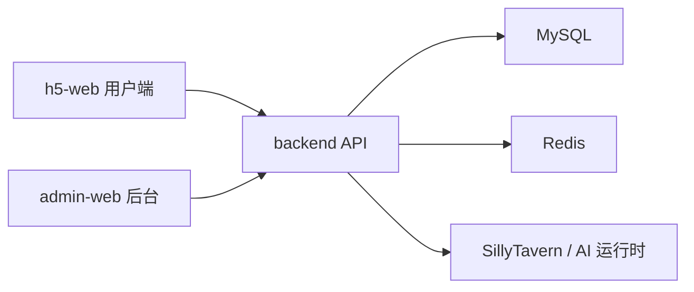

# 接口地图

本文档用于帮助开发者理解前端页面、后台管理端和后端 API 之间的大致对应关系。具体接口实现以 `backend/` 中的 Controller、Service 和路由配置为准。

## 总体关系



## H5 用户端接口方向

| 页面或功能 | 后端能力 |
| --- | --- |
| 首页 / 发现 | 推荐角色、公告、分类、热门内容。 |
| 角色库 | 角色列表、角色筛选、角色详情。 |
| 角色详情 | 角色卡、头像、封面、标签、权限、世界书信息。 |
| 聊天页 | 会话创建、消息发送、续写、重生成、分支、历史消息。 |
| AI 设置 | 模型配置、语音配置、用户偏好。 |
| 我的 | 用户信息、额度、会员权益、订单状态。 |
| 支付 | 订单创建、支付状态、权益发放。 |
| 工单 | 工单创建、工单列表、回复和状态。 |
| 社区 / 私聊 | 用户互动、消息通知、关系链或扩展社交能力。 |

## 后台管理端接口方向

| 后台模块 | 后端能力 |
| --- | --- |
| 首页大屏 | 角色数、用户数、会话数、消息数、订单和生成任务统计。 |
| 用户管理 | 用户查询、状态调整、额度和权益维护。 |
| 角色管理 | 角色查询、创建、编辑、审核、上下架、删除。 |
| 世界书 | 世界书条目、角色关联、启用状态。 |
| 模型路由 | 模型供应商、模型参数、可用状态、调用配置。 |
| 插画作品 | 作品列表、审核、隐藏、驳回、删除、访问口令。 |
| 公告通知 | 公告发布、通知管理、展示状态。 |
| 权益策略 | 免费用户、会员用户、Plus 用户额度和权限配置。 |
| 支付渠道 | 支付配置、回调配置、订单状态维护。 |
| 客服工单 | 工单列表、处理记录、状态流转。 |
| 系统管理 | 菜单、角色、权限、日志和基础后台能力。 |

## 后端主要业务对象

| 对象 | 说明 |
| --- | --- |
| 用户 | 普通用户、后台管理员、权限和状态。 |
| 角色 | 角色卡、展示信息、审核状态、标签和权限。 |
| 会话 | 用户与角色之间的聊天上下文。 |
| 消息 | 聊天消息、生成结果、续写和重生成记录。 |
| 世界书 | 角色设定、背景知识和上下文补充。 |
| 权益 | 免费额度、会员额度、访问权限和消耗规则。 |
| 订单 | 支付订单、支付状态和权益发放。 |
| 工单 | 用户反馈、客服回复和处理状态。 |
| 插画 | 插画作品、审核状态、访问控制和展示信息。 |
| 模型配置 | 模型供应商、模型名称、参数和密钥引用。 |

## 查找接口的方法

建议按这个顺序定位：

1. 从页面路径或按钮文案确定功能模块。
2. 在 `h5-web/` 或 `admin-web/` 中搜索接口调用关键字。
3. 在 `backend/src/main/java/` 中搜索对应 Controller。
4. 查看 Service、Mapper 和数据库迁移脚本，确认数据来源。
5. 如果接口影响前后端字段，同步更新本文档和相关说明。

常用搜索示例：

```bash
rg "角色|character|chat|order|ticket|illustration" h5-web admin-web backend
```

Windows PowerShell：

```powershell
rg "角色|character|chat|order|ticket|illustration" h5-web admin-web backend
```

## 接口维护原则

- 新增接口时保持命名清晰，避免和旧接口语义重叠。
- 面向 H5 的接口注意移动端性能和字段体积。
- 面向后台的接口注意分页、筛选、权限和操作日志。
- 涉及支付、鉴权、上传、模型 Key 的接口必须额外做安全审查。
- 变更接口字段时，同步检查 H5、后台、接口地图和部署说明。
